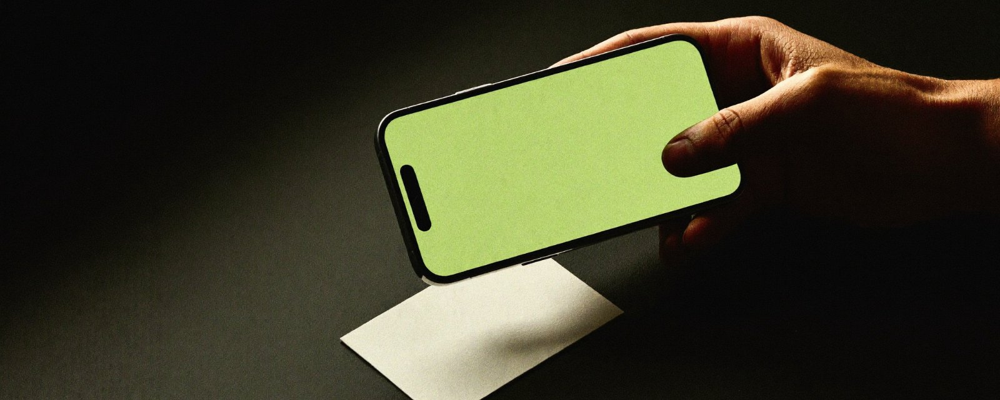
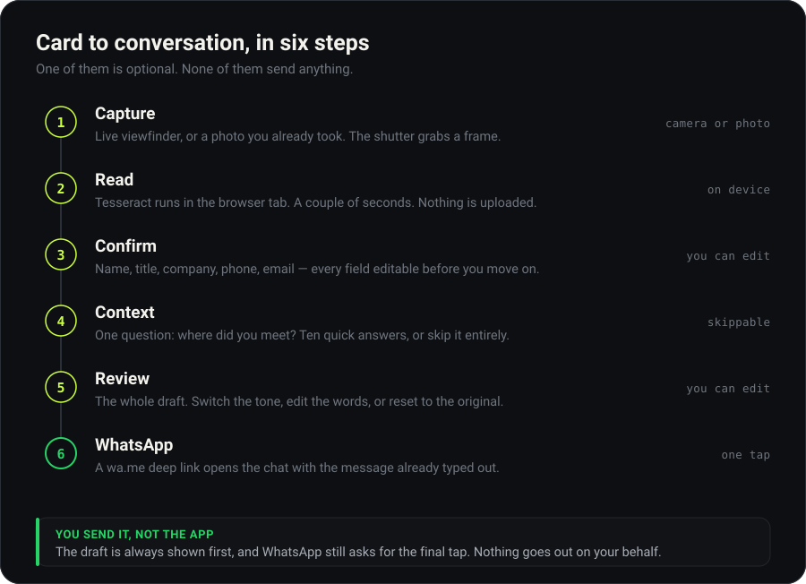
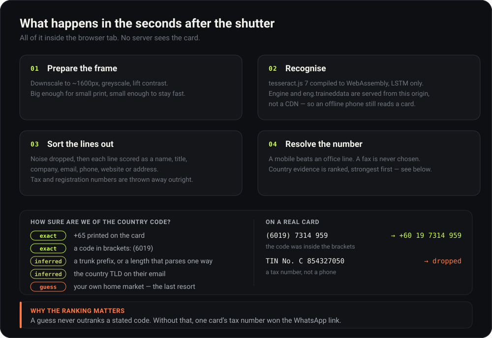
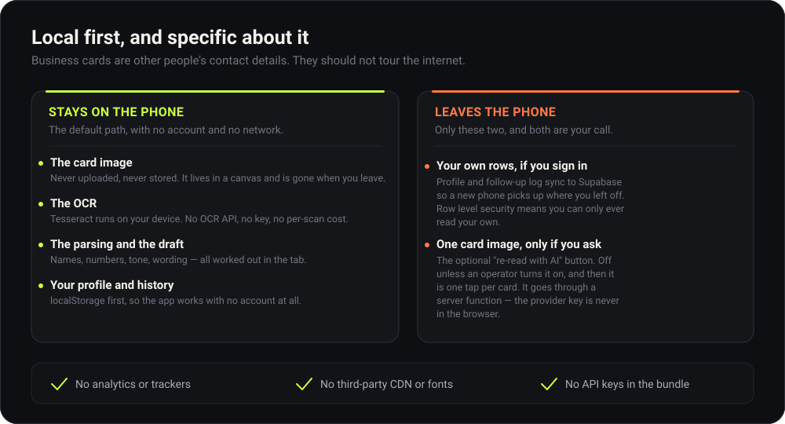

<div align="center">

# Handshake

### Scan a business card. Send the WhatsApp message. Twenty seconds, no typing.

[**Open the app →**](https://handshake-olive.vercel.app)&nbsp;&nbsp;·&nbsp;&nbsp;[How it works](#how-it-works)&nbsp;&nbsp;·&nbsp;&nbsp;[The OCR engine](#the-engine-tesseract-in-the-browser)&nbsp;&nbsp;·&nbsp;&nbsp;[Local first](#local-first-and-specific-about-it)&nbsp;&nbsp;·&nbsp;&nbsp;[Run it yourself](#run-it-yourself)




</div>

---

A sales BDE comes back from a conference with forty business cards and follows up
on maybe six of them. Not because the other thirty-four were bad leads — because
typing a phone number off a card into WhatsApp, then writing something that does
not read like a form letter, takes four minutes a card.

Handshake is that four minutes, rebuilt as twenty seconds. Point the phone at the
card, answer one optional question about where you met, read the draft it wrote,
and hand it to WhatsApp. It is a web app, so there is nothing to install and
nothing to approve on the corporate app store — it opens from a link or a QR code.

**It is also deliberately unglamorous about privacy.** The card is read on the
phone, by the phone. No image is uploaded, no OCR API is called, and there is no
key in the bundle to leak. That is not a marketing position; it is the
[architecture](#local-first-and-specific-about-it), and the diagram below is
specific about the two things that *do* leave the device.

<br>

## How it works



Two of these are worth calling out.

**Step 3 exists because OCR is never perfect.** Every field lands in an editable
box before you go anywhere near a message. A blurry `8` read as a `B` is a
half-second fix, not a failed scan.

**Step 6 is a deep link, not a send.** Handshake opens WhatsApp with the message
already typed into the box. You still tap send. There is no path anywhere in the
app that transmits a message on a user's behalf, and no integration that could.

The message itself is written from the card plus your one-line answer about where
you met, in your choice of three tones. Japanese and Korean cards get a message in
Japanese or Korean — addressed 〜様 by family name, or 〜님 by full name, which is
the convention a first business contact expects and the exact inverse of the
English "Hi Kenji".

<br>

## The engine: Tesseract, in the browser



[Tesseract](https://github.com/tesseract-ocr/tesseract) is an OCR engine that
began at HP in the 1980s, was open sourced in 2005 and spent the following decade
maintained by Google. Here it is compiled to WebAssembly via
[tesseract.js](https://github.com/naptha/tesseract.js), so it runs inside the
browser tab. Only the LSTM model and the English training data ship — about 3 MB
gzipped, cached permanently after the first visit. Engine and data are served
from this app's own origin rather than a CDN, so a phone on airplane mode still
reads a card.

Raw OCR is not the hard part, though. **Turning a page of text into the right
phone number is.** A business card has three or four numbers on it, one of which
is a fax, plus a tax number that looks exactly like a mobile.

That is a real bug, not a hypothetical one. A beta tester sent in a Malaysian
card whose tax number — `C 854327050` — is a perfectly valid Singapore mobile
when read by a Singapore-based user, and it won the WhatsApp link outright. The
fix was to stop treating every number as equally trustworthy: evidence about the
country is now *ranked*, a guess never outranks a code printed on the card, and
lines carrying a tax or registration marker are dropped before phone extraction
even starts.

The 190-odd unit tests in `namecard-scanner/tests/` are mostly this: real cards
from Singapore, Malaysia, Japan, Korea, Taiwan and Hong Kong, and the specific
ways each one broke.

<br>

## Local first, and specific about it



The scanned card belongs to someone who is not using this app. They handed a card
to a person, not to a cloud service, and the architecture should reflect that.

So the default path touches no network at all: capture, OCR, parsing, drafting and
history all happen in the tab, with the profile and log in `localStorage`. Clone
this repo, run `npm run dev`, and it works completely with no account, no
Supabase project and no keys.

Two things can leave the phone, both listed above, and both are the user's
decision:

- **Your own rows**, if you sign in — profile and follow-up history sync to
  Supabase so a new phone picks up where the old one left off. Row level security
  means a signed-in user can only ever read rows they wrote. This matters more
  than usual here: the follow-up log holds *third parties'* contact details.
- **One card image**, if you tap "re-read with AI" — an optional escape hatch for
  a card Tesseract mangles, off unless an operator switches it on, and then one
  tap per card. It goes through a Supabase edge function, so the provider key is
  never in the browser.

<br>

## Run it yourself

```bash
git clone https://github.com/jeratomise/handshake
cd handshake/namecard-scanner
npm install
npm run dev          # http://localhost:5173
```

That is the whole setup. With no environment variables the app runs local-only —
no sign-in, everything in `localStorage`, every feature except cross-device sync.

| | |
| --- | --- |
| `npm test` | 190+ unit tests — parsing, phone resolution, drafting, i18n |
| `npm run e2e` | 38 Playwright journeys, including a fake-camera capture |
| `npm run build` | Type-check and production bundle |
| `npm run marketing` | Rebuilds the sales one-pager and its QR code |

### Deploying your own

Vercel and Supabase, both on free tiers. `vercel.json` is committed and needs no
changes; point Vercel at the `namecard-scanner` directory. For sync and sign-in,
apply `supabase/migrations/*.sql` in order and set `VITE_SUPABASE_URL` and
`VITE_SUPABASE_ANON_KEY`. Full instructions, including the one auth setting no
API can configure, are in the [engineering README](namecard-scanner/README.md).

<br>

## What is in here

| Path | |
| --- | --- |
| [`namecard-scanner/src/lib/`](namecard-scanner/src/lib) | The interesting half: `parseCard`, `phone`, `draft`, `draftIntl`, `ocr` |
| [`namecard-scanner/src/components/`](namecard-scanner/src/components) | Six screens, no UI framework, hand-written CSS |
| [`namecard-scanner/supabase/`](namecard-scanner/supabase) | Migrations and three edge functions |
| [`namecard-scanner/tests/`](namecard-scanner/tests) · [`e2e/`](namecard-scanner/e2e) | Unit tests and Playwright journeys |
| [`namecard-scanner/marketing/`](namecard-scanner/marketing) | The one-pager, the QR code and these diagrams |
| [**`namecard-scanner/README.md`**](namecard-scanner/README.md) | The engineering write-up: every decision, and every bug that caused it |

<br>

## Licence

[MIT](LICENSE) — use it, fork it, ship it inside your own sales org. No attribution
required, though a star is always welcome.

<div align="center">
<br>
<sub>Built with Claude Code · <a href="https://handshake-olive.vercel.app">handshake-olive.vercel.app</a></sub>
</div>
